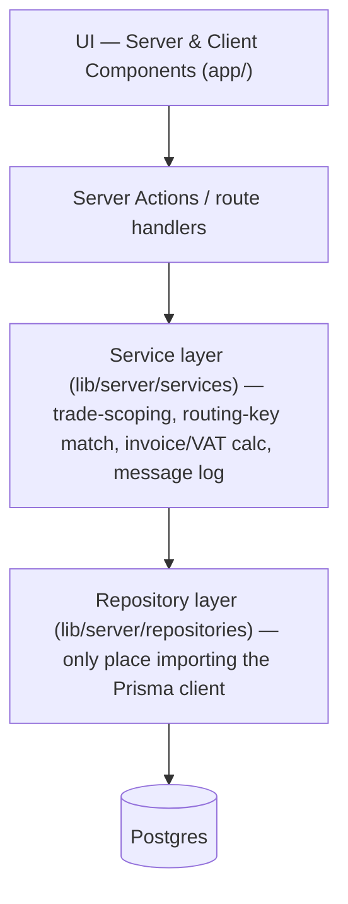
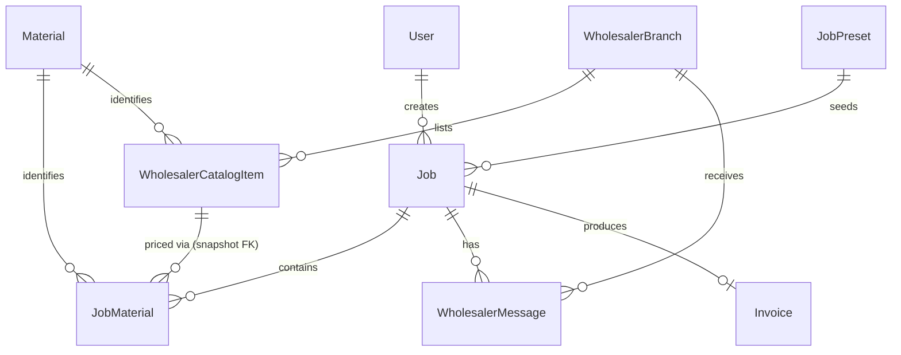

# Architecture Spine — TradesLine

## Design Paradigm

Layered, on Next.js App Router:



UI components never import Prisma directly; they call Server Actions, which call services, which call repositories.

## Invariants & Rules

### AD-1 — Trade-scoped data access

- **Binds:** `JobPreset`, `Material`, `WholesalerBranch`/`WholesalerCatalogItem` queries
- **Prevents:** a query built for one trade silently leaking another trade's presets/materials/wholesalers to a user
- **Rule:** `JobPreset` carries an explicit `trade` column. Every preset/material/wholesaler read goes through a service function that takes the signed-in user's `trade` and filters by it; no repository method returns unscoped catalog rows to a UI path.

### AD-2 — Delivery coverage is routing-key membership, never geo distance

- **Binds:** `WholesalerBranch`, any "does this wholesaler deliver to me" check
- **Prevents:** an independently-built feature adding geocoding/lat-lng/radius math that EXPERIENCE.md explicitly deferred, or hand-rolling a second coverage representation or a second normalization rule
- **Rule:** a `WholesalerBranch` declares coverage only as a list of Eircode routing keys (`servedRoutingKeys: string[]`, e.g. `"D01"`, `"T12"`). A user's routing key is the first 3 characters of the Eircode captured at signup, stored and compared uppercase with whitespace stripped, normalized at exactly one point (a shared util, not re-implemented per query site). Coverage is `userRoutingKey IN branch.servedRoutingKeys` — no other coverage computation is valid.

### AD-3 — Catalog data carries an explicit source, whatever populates it

- **Binds:** `WholesalerBranch`, `WholesalerCatalogItem`
- **Prevents:** a future scraper or API integration writing into the catalog tables through a different shape than the manually-curated rows, splitting "real" data from "seed" data
- **Rule:** every `WholesalerBranch` and `WholesalerCatalogItem` row carries `source: 'manual' | 'api' | 'scrape'`. All catalog writes — manual admin entry today, any future feed — go through the same repository method and table shape; only `source` distinguishes provenance.

### AD-4 — Wholesaler messages are an append-only log, not a send

- **Binds:** `WholesalerMessage`
- **Prevents:** a builder wiring an actual outbound email/SMTP call into what this draft scopes as a manual note
- **Rule:** creating a `WholesalerMessage` only ever inserts a row (`jobId`, `wholesalerBranchId`, `authorUserId`, `body`, `createdAt`). No code path sends email, polls an inbox, or expects a reply to arrive automatically.

### AD-5 — Money is integer cents, computed server-side only

- **Binds:** `JobMaterial.unitPrice`, `Invoice` totals/VAT
- **Prevents:** float rounding drift between the materials-cost-toggle path and the invoice-total path when built independently
- **Rule:** all money fields are integer cents (EUR). VAT (13.5%) and totals are computed once, in the service layer, never re-derived client-side or duplicated in a second code path.

### AD-6 — No password, but a real session

- **Binds:** signup, all authenticated reads/writes
- **Prevents:** either reintroducing a full auth provider (NextAuth/Clerk) for what EXPERIENCE.md scopes as a no-password demo signup, or regressing to the just-removed client-only/no-persistence state
- **Rule:** signup issues a signed httpOnly session cookie referencing the new `User.id`. No password field exists. Session resolution happens through one shared helper (`lib/server/session.ts`) that every Server Action calls to get the current user — no Server Action reads or trusts the cookie directly, and there is no anonymous write path.

### AD-7 — Wholesaler price is snapshotted once, at selection

- **Binds:** `JobMaterial.unitPrice`, `WholesalerCatalogItem.unitPrice`, `Invoice`
- **Prevents:** one feature snapshotting price at wholesaler-selection while another re-derives it live at invoice time, producing silently divergent invoice totals for the same job
- **Rule:** `JobMaterial` carries a mandatory `wholesalerCatalogItemId` FK, set once when a wholesaler is selected; `JobMaterial.unitPrice` is copied from `WholesalerCatalogItem.unitPrice` at that moment and is immutable afterward. Invoice generation always sums stored `JobMaterial.unitPrice` snapshots — it never re-reads `WholesalerCatalogItem` for pricing.

## Consistency Conventions

| Concern | Convention |
| --- | --- |
| Naming (entities, files, interfaces, events) | PascalCase Prisma models (`User`, `Job`, `JobMaterial`, `WholesalerBranch`, `WholesalerCatalogItem`, `WholesalerMessage`, `Invoice`); service files `lib/server/services/<noun>.ts`; repository files `lib/server/repositories/<noun>.ts` |
| Data & formats (ids, dates, error shapes, envelopes) | `id`: `cuid()`; dates: Prisma `DateTime` (UTC), formatted at the UI edge only; money: integer cents; `Job.stage`: literal 7-value enum ratified from the existing prototype's `js/state.js` `STATUS_ORDER` — `job-details`, `materials-needed`, `wholesaler-selected`, `materials-delivered`, `job-started`, `job-completed`, `invoice` (brief.md/EXPERIENCE.md describe "six stages" and silently drop `job-started` — a pre-existing discrepancy this spine resolves in the code's favor; see Deferred) |
| State & cross-cutting (mutation, errors, logging, config, auth) | All writes go through a Server Action → service function; services throw typed errors, Server Actions translate them to form-level messages (matching EXPERIENCE.md's inline-error pattern); session/user resolution happens once per Server Action, not re-derived per repository call |

## Stack

| Name | Version |
| --- | --- |
| Next.js (App Router, TypeScript) | 16.3.4 |
| Prisma ORM | 7.10.0 (pinned stable; `@latest` currently resolves to the 8.x dev line — do not float) |
| PostgreSQL | via Neon, provisioned through the Vercel Marketplace ("Vercel Postgres" as a distinct product was discontinued in 2024/25; Neon is Vercel's current first-party-integrated Postgres path) |
| Hosting | Vercel — single environment for now, no staging/prod split |

## Structural Seed

```text
app/
  signup/            # replaces login; trade + address + Eircode form
  dashboard/          # trade-scoped job list + preset picker
  jobs/[jobId]/        # seven-stage job detail (see Job.stage below)
lib/
  server/
    services/         # trade-scoping, routing-key match, invoice/VAT calc, message log
    repositories/      # Prisma client lives only here
    session.ts         # signed httpOnly cookie helpers
prisma/
  schema.prisma
```



Core entity fields (seed-level, code owns the rest):

| Entity | Key fields |
| --- | --- |
| `User` | `trade`, `addressLine`, `town`, `county`, `eircode`, `routingKey` (derived, normalized per AD-2), `email?` |
| `JobPreset` | `trade`, `jobType`, `label` |
| `Job` | `userId`, `jobPresetId?`, `stage` (7-value enum, see Consistency Conventions) |
| `Material` | canonical cross-wholesaler identity (name, unit) — replaces the prototype's ad hoc `catalogId` string |
| `JobMaterial` | `jobId`, `materialId`, `qty`, `wholesalerCatalogItemId` (FK, set once at selection — AD-7), `unitPrice` (snapshot, immutable — AD-7) |
| `WholesalerBranch` | `trade`, `servedRoutingKeys: string[]`, `source` |
| `WholesalerCatalogItem` | `wholesalerBranchId`, `materialId`, `unitPrice`, `stockStatus`, `leadTimeDays`, `source` |
| `WholesalerMessage` | `jobId`, `wholesalerBranchId`, `authorUserId`, `body`, `createdAt` (append-only) |
| `Invoice` | `jobId`, `includesMaterials`, `vatAmount`, `total` (all cents, computed once per AD-5) |

**Deployment & Environments:** one Vercel project, one Postgres database, no staging/prod split — matches the demo/pitch stakes carried over from brief.md. Revisit when a real customer-facing launch (not just a pitch demo) is planned.

## Capability → Architecture Map

| Capability / Area | Lives in | Governed by |
| --- | --- | --- |
| Signup (trade + address + Eircode) | `app/signup/`, `User` model, `session.ts` | AD-6 |
| Trade-scoped dashboard & job presets | `app/dashboard/`, `JobPreset` (with `trade`) | AD-1 |
| Materials Needed / Wholesaler Selected | `app/jobs/[jobId]/`, `Material`, `JobMaterial`, `WholesalerCatalogItem` | AD-1, AD-2, AD-3, AD-7 |
| Wholesaler delivery matching | `WholesalerBranch.servedRoutingKeys` | AD-2 |
| Wholesaler follow-up log | `WholesalerMessage` | AD-4 |
| Invoice (materials toggle + VAT) | Invoice service | AD-5, AD-7 |

## Deferred

- **Real wholesaler API/EDI integration** — no business relationship with a wholesaler exists yet; `source` field on catalog tables (AD-3) leaves the slot open without a future schema change.
- **Scraping wholesaler sites** — rejected: fragile and likely against most wholesalers' terms of service.
- **Geocoding/lat-lng delivery matching** — routing-key membership (AD-2) covers this need at far lower cost; revisit only if routing-key granularity proves too coarse in practice.
- **Real email sending + inbound reply handling for wholesaler comms** — this draft ships an in-app manual log only (AD-4); `WholesalerMessage`'s current shape (a flat append-only row) is not guaranteed to extend cleanly to a real inbound-reply thread — re-examine its shape rather than assuming it, when this item is picked up. Revisit once real wholesaler order-placement exists (brief.md still scopes real ordering as out).
- **Multi-user/team accounts, payment processing** — unchanged from brief.md's prototype scope.
- **Carpenter / General Builder full preset-material-wholesaler catalogs** — a content task once real catalog data entry begins, not an architectural gap (flagged in EXPERIENCE.md).
- **Automated testing convention** — not decided in this draft; left open rather than invented.
- **Data-seed/migration path** — how the existing researched content in `js/data.js` (materials, wholesalers, presets) gets ported into the new Postgres schema is not decided here; a build-time task, not an architectural one.
- **Native APK packaging** — confirmed compatible with the chosen stack via a thin WebView/TWA wrapper (a native Android shell pointed at the deployed Next.js URL) — Server Actions/SSR keep running server-side unchanged, the phone is just another client. Rejected for now: Capacitor + Next.js static export, which would force moving dynamic data off Server Actions (conflicts with the layered paradigm's Server-Actions-as-only-write-path rule) — only reconsider if deep native device access is later needed. Not solved by either path: **offline use at a job site** still requires a live connection for every Server Action; if on-site connectivity turns out to matter (brief.md's persona works on-site), that's its own future decision, not something "having an APK" solves for free.
- **brief.md refresh** — still describes an electrician-only, login-based, no-persistence, six-stage product; contradicted by this spine's Postgres persistence, multi-trade signup, message-log entity, and the ratified 7-stage `Job.stage` enum. Offered to the user as a follow-up at Finalize, not resolved in this spine.
